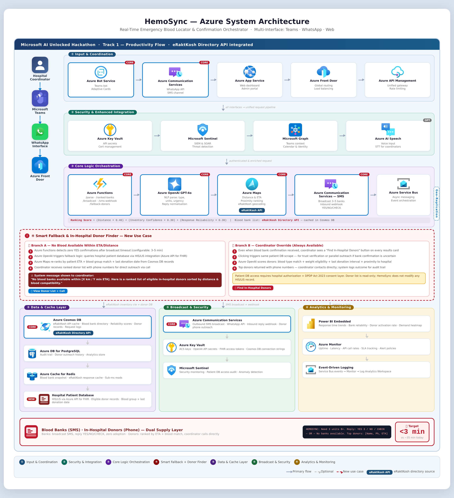

# HemoSync

[](https://www.typescriptlang.org/)
[](https://learn.microsoft.com/azure/azure-functions/)
[](https://nodejs.org/)
[](LICENSE)
[](CONTRIBUTING.md)

**AI-powered emergency blood coordination. 35 minutes → 3 minutes.**


## The Problem

- Blood coordinators spend 35+ minutes calling banks one by one during critical emergencies
- No single view of real-time availability across Delhi NCR's 100+ registered blood banks
- When banks fail, fallback to in-hospital donors is entirely manual and unreliable


## How It Works

1. **Request** — Coordinator sends a voice note or text via Teams, WhatsApp, or the web dashboard
2. **Parse** — Azure OpenAI (GPT-4o) extracts blood type, units, urgency, and hospital from natural language
3. **Rank** — Banks within 10 km are scored by reliability, distance, and cached stock; top 5 selected
4. **Broadcast** — MSG91 SMS sent simultaneously to all 5 banks; status tracked in real time
5. **Confirm** — First bank to reply YES is confirmed; request marked FULFILLED
6. **Done** — If no bank responds in 8 minutes, FHIR query finds nearest eligible in-hospital donor


## Architecture




## Azure Services Used

| Service | Purpose | Docs |
|---|---|---|
| Azure Functions v4 | Serverless API (7 endpoints) | [docs](https://learn.microsoft.com/azure/azure-functions/) |
| Azure OpenAI (GPT-4o) | Natural language request parsing | [docs](https://learn.microsoft.com/azure/ai-services/openai/) |
| Azure Cosmos DB | Operational store (blood banks, requests) | [docs](https://learn.microsoft.com/azure/cosmos-db/) |
| Azure Database for PostgreSQL | Audit log + analytics | [docs](https://learn.microsoft.com/azure/postgresql/) |
| Azure Cache for Redis | Bank rank cache (sub-ms reads) | [docs](https://learn.microsoft.com/azure/azure-cache-for-redis/) |
| Azure Service Bus | Async broadcast queue | [docs](https://learn.microsoft.com/azure/service-bus-messaging/) |
| Azure Communication Services | WhatsApp channel + SMS interface | [docs](https://learn.microsoft.com/azure/communication-services/) |
| Azure Bot Service | Microsoft Teams bot | [docs](https://learn.microsoft.com/azure/bot-service/) |
| Azure API Management | Gateway, rate limiting, API keys | [docs](https://learn.microsoft.com/azure/api-management/) |
| Azure Maps | Distance + ETA calculation | [docs](https://learn.microsoft.com/azure/azure-maps/) |
| Azure AI Speech | Browser-side voice-to-text (STT) | [docs](https://learn.microsoft.com/azure/ai-services/speech-service/) |
| Azure API for FHIR | Fallback donor queries | [docs](https://learn.microsoft.com/azure/healthcare-apis/fhir/) |
| Azure Key Vault | Secret management | [docs](https://learn.microsoft.com/azure/key-vault/) |
| Azure Application Insights | Telemetry + tracing | [docs](https://learn.microsoft.com/azure/azure-monitor/app/app-insights-overview/) |
| Azure Monitor | Alerts, dashboards | [docs](https://learn.microsoft.com/azure/azure-monitor/) |
| Microsoft Sentinel | Security analytics | [docs](https://learn.microsoft.com/azure/sentinel/) |
| Power BI Embedded | Analytics dashboard in web app | [docs](https://learn.microsoft.com/power-bi/developer/embedded/) |
| Azure Static Web Apps | Web dashboard hosting | [docs](https://learn.microsoft.com/azure/static-web-apps/) |
| Azure App Service | WhatsApp handler + Teams bot hosting | [docs](https://learn.microsoft.com/azure/app-service/) |
| Microsoft Entra ID | Authentication (MSAL) | [docs](https://learn.microsoft.com/azure/active-directory/) |
| Microsoft Graph API | User dept + org enrichment | [docs](https://learn.microsoft.com/graph/) |
| Azure Bicep | Infrastructure as Code | [docs](https://learn.microsoft.com/azure/azure-resource-manager/bicep/) |
| Azure Container Registry | Docker image storage | [docs](https://learn.microsoft.com/azure/container-registry/) |


## Quick Start

```bash
# 1. Clone and install
git clone https://github.com/Varshini3077/Hemosync.git && cd Hemosync
pnpm install

# 2. Copy and fill environment variables
cp .env.example .env

# 3. Start local dependencies (PostgreSQL + Redis)
docker-compose up -d

# 4. Seed local database
pnpm seed:local

# 5. Start all apps
pnpm dev
```

Dashboard: http://localhost:5173 | Functions: http://localhost:7071


## Environment Variables

| Variable | Description | Required |
|---|---|---|
| `AZURE_OPENAI_ENDPOINT` | Azure OpenAI resource endpoint | Yes |
| `AZURE_OPENAI_KEY` | Azure OpenAI API key | Yes |
| `AZURE_OPENAI_DEPLOYMENT_NAME` | GPT-4o deployment name | Yes |
| `COSMOS_CONNECTION_STRING` | Cosmos DB connection string | Yes |
| `COSMOS_DATABASE_NAME` | Cosmos DB database name (default: hemosync) | No |
| `REDIS_CONNECTION_STRING` | Azure Cache for Redis connection | Yes |
| `POSTGRES_HOST` | PostgreSQL server hostname | Yes |
| `POSTGRES_DATABASE` | PostgreSQL database name | Yes |
| `POSTGRES_USER` | PostgreSQL username | Yes |
| `POSTGRES_PASSWORD` | PostgreSQL password | Yes |
| `SERVICE_BUS_CONNECTION_STRING` | Azure Service Bus connection string | Yes |
| `SERVICE_BUS_QUEUE_NAME` | Broadcast queue name | Yes |
| `ACS_CONNECTION_STRING` | Azure Communication Services connection | Yes |
| `MSG91_AUTH_KEY` | MSG91 SMS gateway auth key | Yes |
| `MSG91_SENDER_ID` | MSG91 sender ID (DLT-registered) | Yes |
| `AZURE_MAPS_SUBSCRIPTION_KEY` | Azure Maps subscription key | Yes |
| `AZURE_SPEECH_KEY` | Azure AI Speech key (browser STT) | Yes |
| `AZURE_SPEECH_REGION` | Azure AI Speech region | Yes |
| `FHIR_ENDPOINT` | Azure API for FHIR endpoint | Yes |
| `BOT_APP_ID` | Teams bot app ID | Yes |
| `BOT_APP_PASSWORD` | Teams bot app password | Yes |
| `POWERBI_CLIENT_ID` | Power BI embedded client ID | No |
| `POWERBI_REPORT_ID` | Power BI report ID | No |
| `APIM_GATEWAY_URL` | APIM gateway URL | No |
| `KEY_VAULT_URI` | Azure Key Vault URI (production) | No |
| `APPLICATIONINSIGHTS_CONNECTION_STRING` | App Insights telemetry | No |
| `VITE_API_BASE_URL` | Web dashboard API base URL | No |
| `NODE_ENV` | Node environment (development/production) | No |

See [`.env.example`](.env.example) for the full list with descriptions.


## Project Structure

```
Hemosync/
├── api/                    # Azure Functions (7 endpoints)
│   └── src/
├── apps/
│   ├── web/                # React + Vite dashboard
│   ├── teams-bot/          # Bot Framework Teams bot
│   └── whatsapp-handler/   # ACS WhatsApp webhook handler
├── packages/
│   ├── types/              # Shared TypeScript types
│   ├── ui/                 # Shared React components
│   ├── tsconfig/           # Shared tsconfig base
│   └── eslint-config/      # Shared ESLint config
├── db/
│   ├── schema.sql          # Canonical PostgreSQL schema
│   ├── migrations/         # Numbered migration files
│   └── seeds/              # Dev seed data (blood banks + donors)
├── infra/
│   ├── modules/            # Bicep modules (18 Azure services)
│   ├── parameters/         # Environment-specific parameters
│   └── deploy.sh           # One-command deployment script
├── scripts/                # Seed, smoke test, health check scripts
├── tests/
│   ├── integration/        # Jest integration tests
│   └── e2e/                # Playwright end-to-end tests
├── docs/                   # API reference, deployment guide, ADRs
└── .devcontainer/          # GitHub Codespaces / VS Code Dev Container
```


## API Reference

See [`docs/api-reference.md`](docs/api-reference.md) for full documentation of all 7 endpoints.


## Deployment

See [`docs/deployment.md`](docs/deployment.md) for step-by-step Azure deployment instructions.


## Local Development

See [`docs/local-development.md`](docs/local-development.md) for getting running locally in under 5 minutes.


## Contributing

See [`CONTRIBUTING.md`](CONTRIBUTING.md). PRs welcome.


## License

MIT — see [`LICENSE`](LICENSE).
